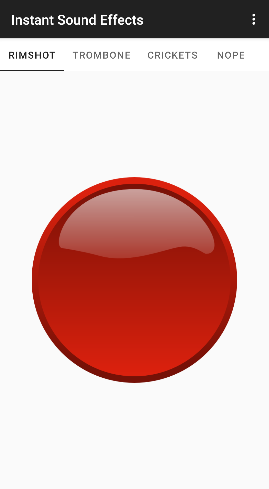

SoundBored
=================================

Latest version: 2.1 (released 9 October 2019)

### License

[GNU GPL v3](https://www.gnu.org/licenses/gpl-3.0.en.html)

### Creators

* Code written by [Brian Nezvadovitz](https://github.com/brinez) Copyright (c) 2012-2013
* Ported to the modern Android version by [Andrej Shadura](https://github.com/andrewshadura) Copyright (c) 2019
* Forked for open source use by [@tucker-tyler](https://github.com/tucker-tyler) Copyright (c) 2021

Open Source App

